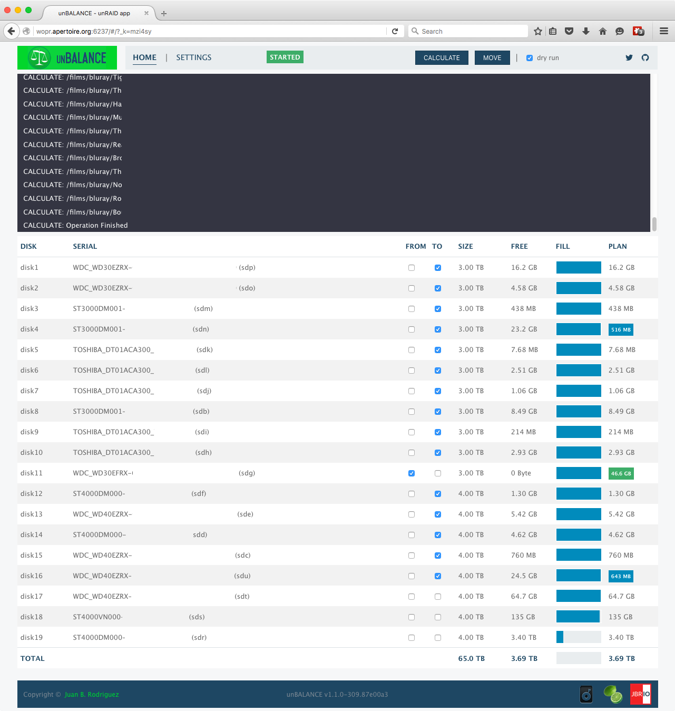
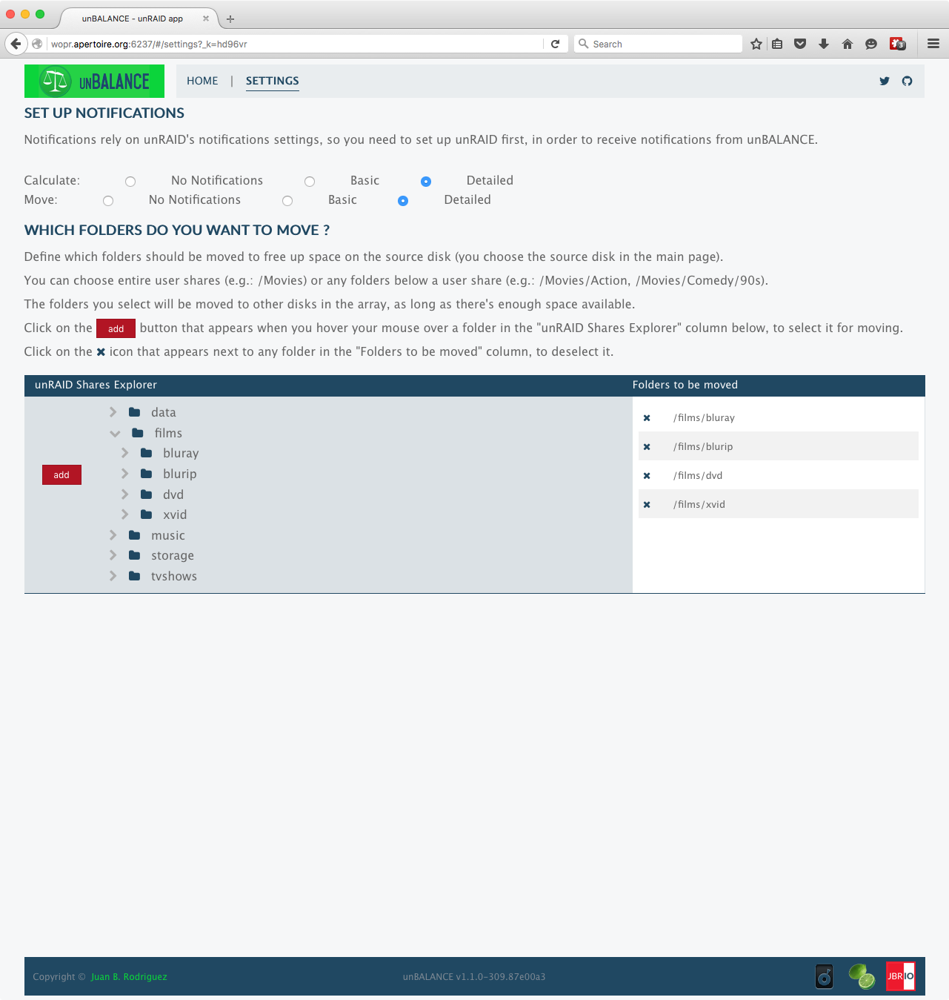

unBALANCE
=========

*tl;dr* **unBALANCE** is an [unRAID](http://lime-technology.com) app to free up space from one of the disks in the array, by moving folders and files to other disks.

## Screenshot

## Upgrade Notes for v1.2.x
For those upgrading from previous versions (v0.7.4 and below), please take note of the following changes:

- unBALANCE is now distributed as a plugin rather than a docker container. The reason is to have easier access to  unRAID's filesystem, for proper app operation. This should also fix some known issues such as drives not being recognized when recently added or formatted, and being unable to move Apple's Time Machine backups.
- The notifications system is based on unRAID's settings, so you need to set up unRAID's notifications first. This also means that you must be running 6.1 to receive emails and other unRAID alerts
- The configuration file format has changed, so you need to set up folders from scratch (it will be easier with this version).

## Introduction
With unBALANCE, you select a disk that you want to have as much free space available as possible, and it will move the folders/files to other disks filling them up, as space allows.

In other words, it takes everything off a disk and spreads it among your other disks to clear the selected disk.

The logic is quite simple: 
Get all elegible folders from the source disk 
Order the target disks by free space available 
For each disk, fill it up as much as possible with folders/files from the source disk, leaving some headroom (currently set at 450Mb). 

~~Internally, all move operations are handled by [diskmv](https://github.com/trinapicot/unraid-diskmv).~~

Internally, it issues a slight variation of [this rsync command](https://lime-technology.com/forum/index.php?topic=37490.msg449941#msg449941).

Check [this post](https://lime-technology.com/forum/index.php?topic=45352.msg476018#msg476018) for additional information.

The icon was created by [hernandito](http://lime-technology.com/forum/index.php?topic=39707.msg372508#msg372508).

The array must be started for the app to work.

The first time you open the app, you are redirected to the settings page, where you can navigate your user shares, to select which folders you want to move.

You can Select an entire user share (/films in the screenshot below) or any folder(s) under the user shares (/films/bluray for example).

## Use Cases
This is one of the use cases for unBALANCE

[kizer](http://lime-technology.com/forum/index.php?topic=45352.msg435488#msg435488)  
"For example, I'm trying to remove all files off my Disk4 so I can format it to XFS. I selected all the shares I want moved on a particular disk in Settings, then to Home and clicked all the drives I want it to populate, clicked the Calculate button to make sure it has room among all the disks, finally clicked Move and it rips along"

## Installation
There are 2 ways to install this application

- Apps Tab (Community Application) 
Go to the Apps tab 
Click on the Plugins button (the last one) 
Look for unBALANCE 
Click Install

- Plugins Tab (manual) 
Go to the Plugins tab 
Click on Install Plugin 
Paste the following address in the input field: https://raw.githubusercontent.com/jbrodriguez/unraid/master/plugins/unbalance.plg 
Click Install

## Running the app
After installing the plugin, you can access the web UI, via the following methods:

- Method 1 
Go to Settings > Utilities 
Click on unBALANCE 
Click on Open Web UI 

- Method 2 
Go to Plugins > Installed Plugins 
Click on unBALANCE 
Click on Open Web UI 

- Method 3 
Navigate with your browser to http://Tower:6237/ (replace Tower with the address/name of your unRAID server) 

As mentioned previously, the app will show the Settings page the first time it's run.

Also, on the main page, the dry-run option is selected by default, which  means that the move operation is simulated (no folders/files will be moved).

To perform an actual move operation, uncheck the dry-run checkbox.

## Credits
~~This app uses the [diskmv](https://github.com/trinapicot/unraid-diskmv) script (check the [forum thread](http://lime-technology.com/forum/index.php?topic=36201.0) for additional information).~~

The icon was courteously created by [hernandito](http://lime-technology.com/forum/index.php?topic=39707.msg372508#msg372508) (fellow unRAID forums member)

It was built with:

- [Go](https://golang.org/) - Back End
- [echo](https://github.com/labstack/echo) - REST and websocket api
- [pubsub](https://github.com/tuxychandru/pubsub/) (slightly modified)
- [React](https://facebook.github.io/react/) - Front End
- [reactorx](https://github.com/jbrodriguez/reactorx) - Flux/Redux-like React framework
- [flexboxgrid](http://flexboxgrid.com/) - CSS3 flex based grid system
framework
- [Webpack](https://webpack.github.io/) - Build toolchain

## License
[MIT license](http://jbrodriguez.mit-license.org)
