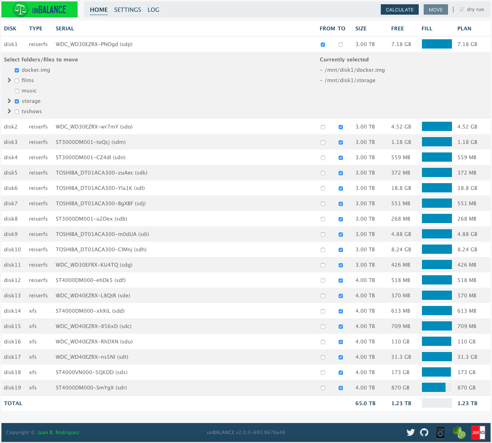
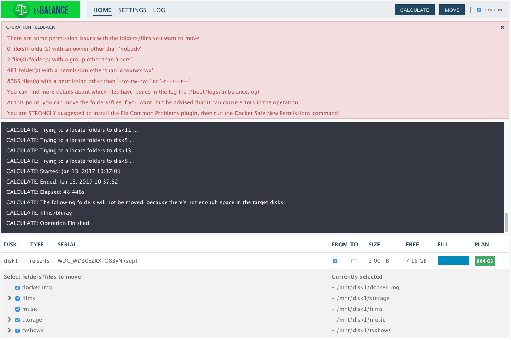
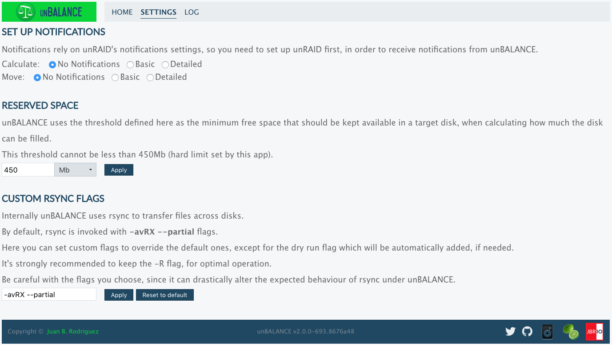
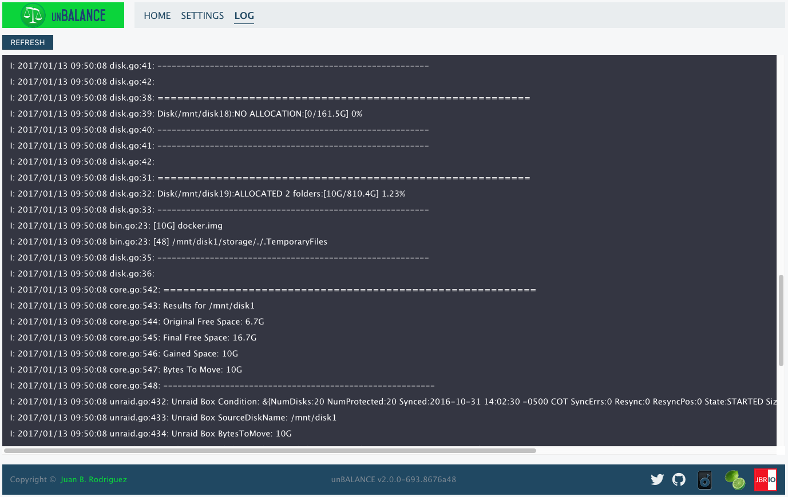

unBALANCE
=========

*tl;dr* **unBALANCE** is an [unRAID](http://lime-technology.com) app to free up space from one of the disks in the array, by moving folders and files to other disks.

## [Changelog](https://github.com/jbrodriguez/unbalance/releases)

## Screenshot

## Introduction
unBALANCE helps you manage the free space of the disks in your unRAID array.

It's versatile in the fact that it can serve multiple purposes, based on your needs.

Some of the use cases are:
- Empty a disk, in order to change filesystems (read [kizer's example](http://lime-technology.com/forum/index.php?topic=45352.msg435488#msg435488)).
- Move a specific folder from a disk to another disk.
- Split your movies/tv shows/games folder from a disk to other disks.

You will certainly come up with other examples as soon as you install it.

## Core Features
 - **Makes sure to fill the target disk(s) as much as possible, without
running out of space** 
If it can't move some files/folders, it will inform you in the console and via notifications (if you
set them up in the settings), before any actual move takes place.

 - **Operates in the background** 
 You can close your browser while the move operation is ongoing. It will keep moving files on the
 server and show you the current progress as soon as you reopen the browser.

These are the reasons it's split into two phases:
#### Calculate
The logic is simple
- Get the contents of the selected files/folders from the source disk
- Order the target disks by free space available
- For each target disk, calculate how much it can be filled up with files/folder from the source disk, leaving some headroom (currently set at 450Mb).

Additionally, it will check files/folders permissions, to warn about potential issues during the move phase.

#### Move
~~Internally, all move operations are handled by [diskmv](https://github.com/trinapicot/unraid-diskmv).~~

Internally, it issues a slight variation of [this rsync command](https://lime-technology.com/forum/index.php?topic=37490.msg449941#msg449941).

Check [this post](https://lime-technology.com/forum/index.php?topic=45352.msg476018#msg476018) for additional information.

## Installation
There are 2 ways to install this application

- Apps Tab (Community Application) 
Go to the Apps tab 
Click on the Plugins button (the last one) 
Look for unBALANCE 
Click Install

- Plugins Tab (manual) 
Go to the Plugins tab 
Click on Install Plugin 
Paste the following address in the input field: https://raw.githubusercontent.com/jbrodriguez/unraid/master/plugins/unbalance.plg 
Click Install

## Running the app
After installing the plugin, you can access the web UI, via the following methods:

- Method 1 
Go to Settings > Utilities 
Click on unBALANCE 
Click on Open Web UI 

- Method 2 
Go to Plugins > Installed Plugins 
Click on unBALANCE 
Click on Open Web UI 

- Method 3 
Navigate with your browser to http://Tower:6237/ (replace Tower with the address/name of your unRAID server) 

## Quick Start
- Click the FROM column of the disk you want to empty
- Choose one or more files/folders you want to move (the CALCULATE button will now be enabled)
- Click the TO column of the disks you want the files to be moved to
- Click the CALCULATE button 
It will display the console showing the progress of the calculate phase. 
Once it's done, it will show how much space both source and target disks will have available (PLAN column). 
The screenshot below shows the warnings from the permissions check, as well as the message console

- Click the MOVE button (dry-run checked/unchecked) 
If dry-run is checked, no files/folder will be actually moved. Otherwise the move operation will actually take place. 
In either case, the console will log progress messages. Also, a progress status will appear in the navigation bar.

## Other Features
### Settings

These are pretty much straigthforward.

A word of caution with the custom rsync flags: it's for **power users** only.

unBALANCE is optimized to work with the default flags, you must be VERY knowledgeable in rsync if you
want to change them.

### Log

## Credits
~~This app uses the [diskmv](https://github.com/trinapicot/unraid-diskmv) script (check the [forum thread](http://lime-technology.com/forum/index.php?topic=36201.0) for additional information).~~

The icon was courteously created by [hernandito](http://lime-technology.com/forum/index.php?topic=39707.msg372508#msg372508) (fellow unRAID forums member)

It was built with:

- [Go](https://golang.org/) - Back End
- [echo](https://github.com/labstack/echo) - REST and websocket api
- [pubsub](https://github.com/tuxychandru/pubsub/) (slightly modified)
- [React](https://facebook.github.io/react/) - Front End
- [reactorx](https://github.com/jbrodriguez/reactorx) - Flux/Redux-like React framework
- [flexboxgrid](http://flexboxgrid.com/) - CSS3 flex based grid system
framework
- [Webpack](https://webpack.github.io/) - Build toolchain

## License
MIT
