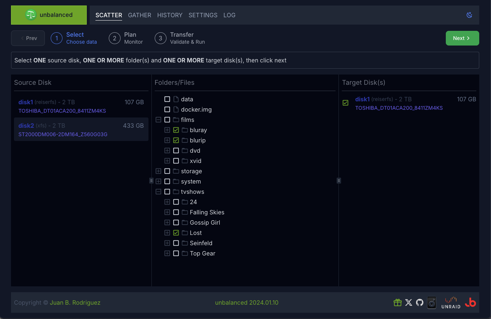
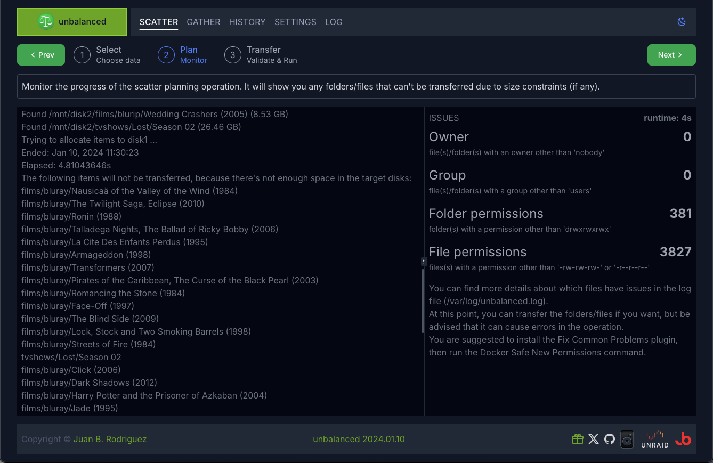
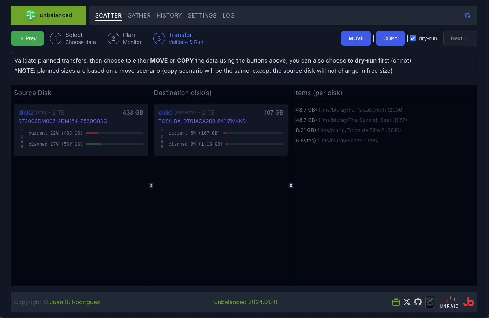
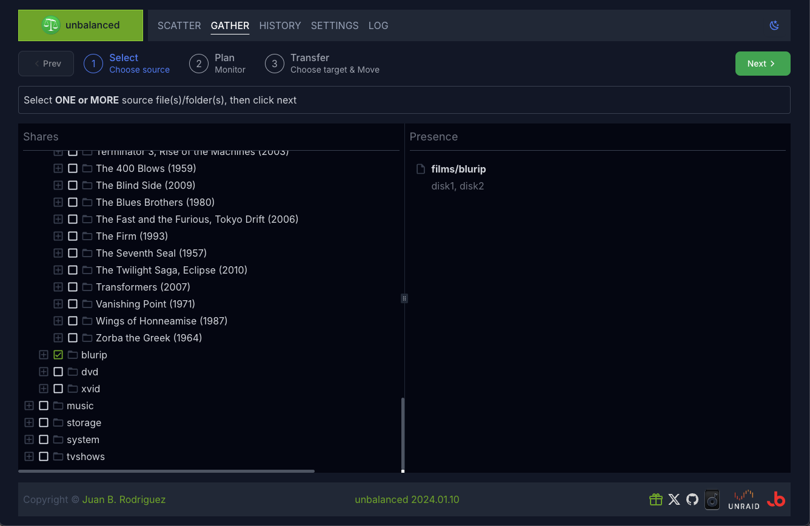
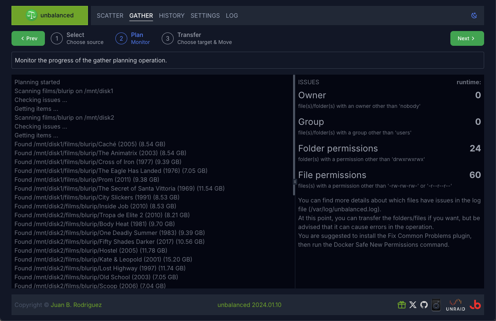
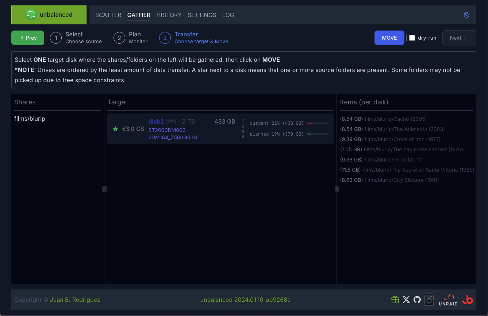
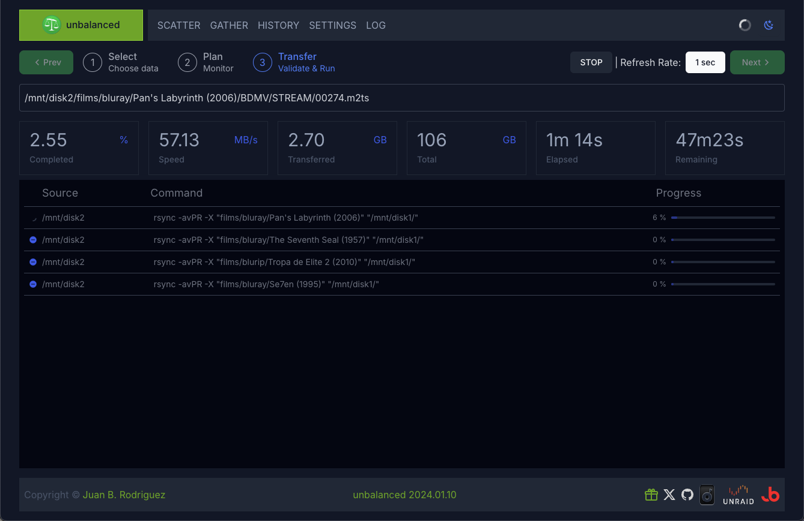
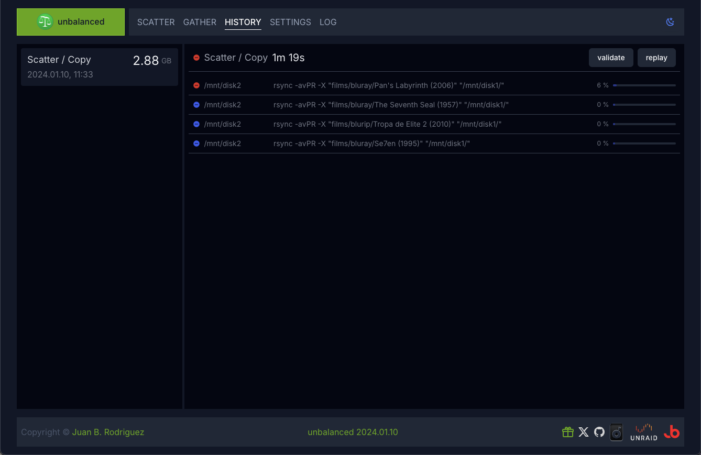
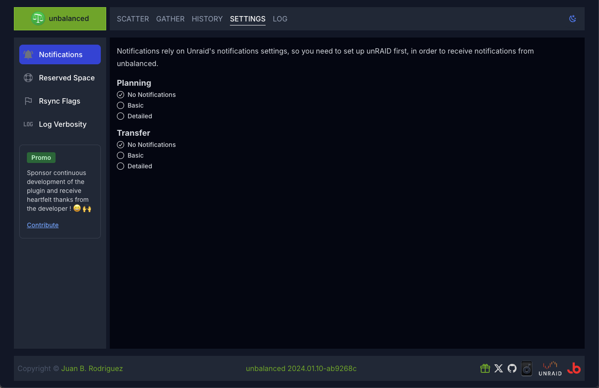
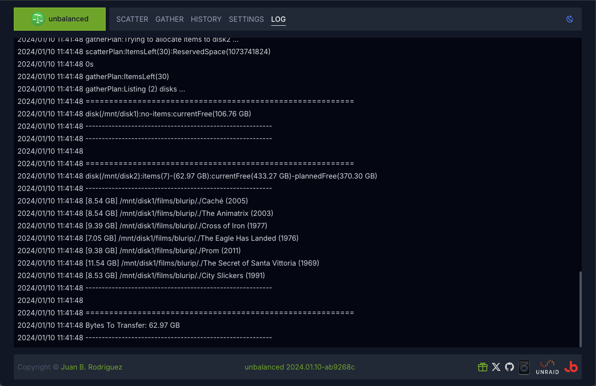

# unbalanced

_tl;dr_ **unbalanced** is an [Unraid](https://unraid.net/) plugin to transfer files/folders between disks in your array.

## Support Fund

If you wish to do so, read how to [support the developer](https://jbrio.net/unbalanced).

## [Changelog](https://github.com/jbrodriguez/unbalance/releases)

## Screenshot

## Introduction

unbalanced helps you manage space in your Unraid array, via two operating modes:

- **Scatter**  Transfer data out of a disk, into one or more disks

- **Gather**  Consolidate data from a user share into a single disk

It's versatile and can serve multiple purposes, based on your needs.

Some of the use cases are:

- Empty a disk, in order to change filesystems (read
  [kizer's example](https://forums.unraid.net/topic/43651-plug-in-unbalance/page/2/#comment-431428))
- Move all seasons of a tv show into a single disk
- Move a specific folder from a disk to another disk
- Split your movies/tv shows/games folder from a disk to other disks

You'll likely come up with other scenarios as you play around with it.

## Core Features

- **Makes sure to fill the target disk(s) as much as possible, without running out of space**  If it can't transfer
  some files/folders, it will inform you in the console and via notifications (if you set them up in the settings),
  before any actual transfer takes place.

- **Operates in the background**  You can close your browser while the transfer operation is ongoing. It will keep
  transferring files on the server and show you the current progress as soon as you reopen the browser.

- **Transfer operations work at the disk level (not at the user share level)**  This avoids file/folder clobbering.

> [!IMPORTANT]
> IMPORTANT: I suggest giving unbalanced exclusive access to disks (disable mover and/or any dockers that write to disks), so that free space calculation are not affected. If you're only reading data (streaming, etc.), it shouldn't be issue, although the operations may run slower.

## SCATTER Instructions

Scatter will transfer data from a source disk into one or more target disks, according to your selection, by filling the target disks, sorted by free space available, as much as possible.

> [!NOTE]
> Scatter doesn't distribute data evenly across disks. It will fill up the first disk, then the second, and so on.

It involves the following steps:

**1 - Select**  
Choose the source disk, select the files/folders you want to transfer and choose the target disk(s).

**2 - Plan**  
The logic is:

- Get the contents of the selected files/folders from the source disk
- Order the target disks by free space available
- For each target disk, calculate how much it can be filled up with files/folder from the source disk, leaving some
  headroom (currently set at 1Gb).

Additionally, it will check files/folders permissions, to warn about potential issues during the transfer stage.

**3 - Transfer**   You can either MOVE or COPY the files.

- MOVE   Will first copy the files/folders into the target disk(s), and delete them as soon as the copy is finished.

- COPY   Will simply transfer the files/folders into the other disk(s).  **NOTE**: Beware that COPY doesn't
  delete files/folders on the source disk, so you will be essentially duplicating the data.

~~Internally, all move operations are handled by [diskmv](https://github.com/trinapicot/Unraid-diskmv).~~

Internally, it issues a slight variation of
[this rsync command](https://forums.unraid.net/topic/35815-re-format-xfs-on-replacement-drive-convert-from-rfs-to-xfs-discussion-only/page/12/#comment-445880).

Check [this post](https://forums.unraid.net/topic/43651-plug-in-unbalance/page/11/#comment-471957) for additional
information.

**4 - Validate (optional)**   VALIDATE will only be enabled for a SCATTER / COPY operation. Just click the Validate
button in the [History](#history) screen and the operation will be replayed, but with checksum comparisons (instead of
the simpler size/modification time check).

When using default flags, VALIDATE rsync will be invoked as **-rcvPRX**.

## GATHER Instructions

GATHER will consolidate data from a user share into a single disk.

It involves the following steps:

**1 - Select**

The 'Shares' column lets you navigate your user shares, to choose a folder to consolidate

When a folder is selected, the current selection and the drives where this folder is located are displayed in the 'Presence' column.

Once you've chosen the folder, click NEXT.

**2 - Plan**
The logic is:

- Find the drives where the folder is located and how much space they occupy
- Calculate how much data needs to be transferred to each potential target disk

Additionally, it will check files/folders permissions, to warn about potential issues during the transfer stage.

**3 - Move**  

This page shows which drives have enough space to hold the contents of the folder chosen in the previous step.

They are shown in descending order by how little data transfer will be required.

A star next to a drive means that the folder is present there.

Choose a target disk, then click Move to start the transfer operation.

## Installation

There are 2 ways to install this application

- Apps Tab (Community Application)  Go to the Apps tab  Click on the Plugins button (the last one)  Look for
  unbalanced  Click Install

- Plugins Tab (manual)  Go to the Plugins tab  Click on Install Plugin  Paste the following address in the
  input field: https://github.com/jbrodriguez/unbalance/releases/latest/download/unbalanced.plg  Click Install

## Running the app

After installing the plugin, you can access the web UI, via the following methods:

- Method 1  Go to Settings > Utilities  Click on unbalanced  Click on Open Web UI 

- Method 2  Go to Plugins > Installed Plugins  Click on unbalanced  Click on Open Web UI 

- Method 3  Navigate with your browser to http(s)://Tower:7090/ (replace Tower with the address/name of your Unraid
  server) 

## Other Features

### Transfer

Here you can monitor the progress of an operation. It shows overall metrics, as well as each invididual command as they
unfold.

### History

unbalanced keeps a history of the operations you have run, showing each command that was executed.

You can replay the most recent operation (excluding dry-runs) or validate the most recent Scatter Copy.

Additionally, you can review operations which contain one or more flagged rsync commands.

If an rsync command has been flagged (applies to Gather and Scatter/Move operations), unbalanced will not delete the source folders/files.

This allows you to check the issue in detail and take any action deemed necessary.

Once you've done that, you can delete the source folders/files through the UI, if you want.

### Settings

These are pretty much straigthforward.

A word of caution with the custom rsync flags: it's for **power users** only.

unbalanced is optimized to work with the default flags, you must be VERY knowledgeable in rsync if you want to add any
flag.

### Log

## Videos

> NOTE: this refers to an older version of unbalanced, but the concepts are the same.

Thanks to gridrunner (Unraid forum member), you can watch unbalanced in action !

[Must Have Unraid Plugins - Part 3 Disk Utility Plugins](https://www.youtube.com/watch?v=Wz4-YlH1lTk)

The discussion specific to unbalanced starts [here](https://youtu.be/Wz4-YlH1lTk?t=859).

## Credits

~~This app uses the [diskmv](https://github.com/trinapicot/unraid-diskmv) script (check the
[forum thread](https://forums.unraid.net/topic/34547-diskmv-a-set-of-utilities-to-move-files-between-disks/) for additional information).~~

The icon was graciously created by
[hernandito](https://forums.unraid.net/topic/38028-docker-unbalance/#comment-368452) (fellow Unraid forums member)

It was built with:

- [Go](https://golang.org/) - Back End
- [echo](https://github.com/labstack/echo) - REST and websocket api
- [pubsub](github.com/cskr/pubsub) - Pub/Sub implementation
- [React](https://facebook.github.io/react/) - Front End
- [zustand](https://github.com/pmndrs/zustand) - Flux/Redux-like React framework
- [tailwind](https://tailwindcss.com) - Css framework
- [vite](https://vitejs.dev) - Tooling

## License

MIT
