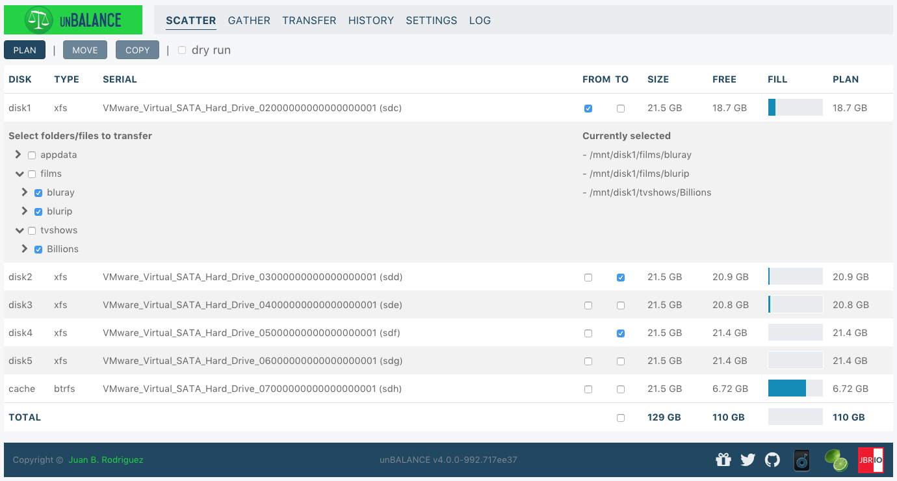
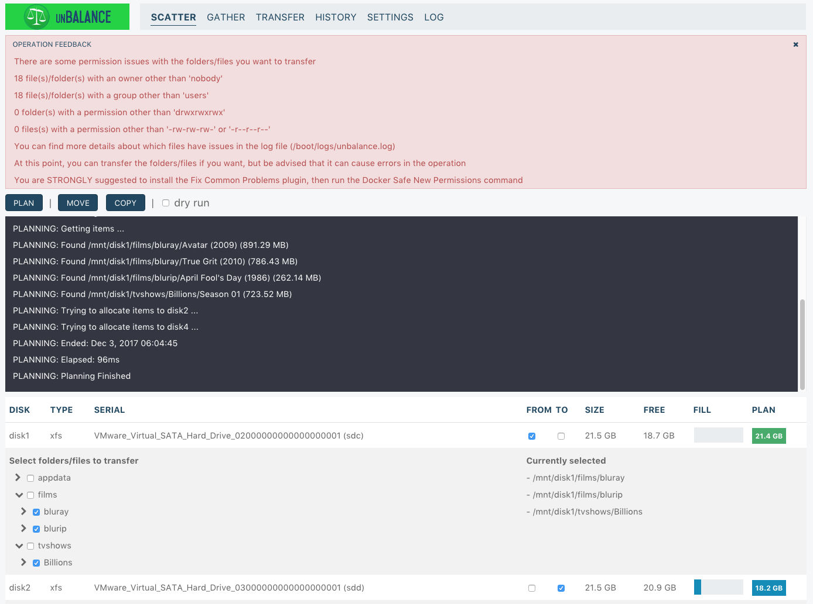
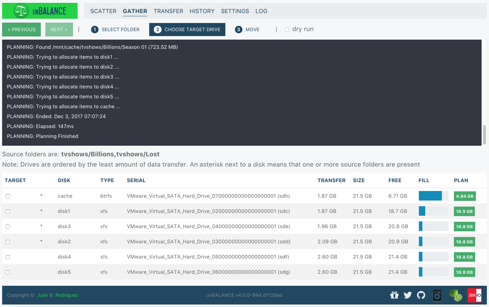
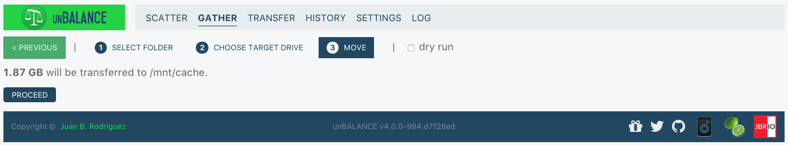
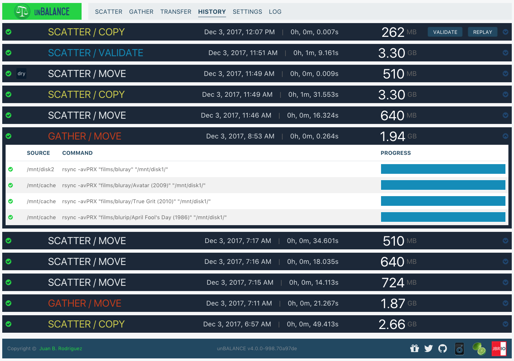

# unBALANCE

_tl;dr_ **unBALANCE** is an [unRAID](https://lime-technology.com) plugin to transfer files/folders between disks in your
array.

## Support Fund

If you wish to do so, learn how to [support the developer](DONATIONS.md).

## [Changelog](https://github.com/jbrodriguez/unbalance/releases)

## Screenshot

## Introduction

unBALANCE helps you manage space in your unRAID array, via two operating modes:

* **Scatter**  Transfer data out of a disk, into one or more disks

* **Gather**  Consolidate data from a user share into a single disk

It's versatile and can serve multiple purposes, based on your needs.

Some of the use cases are:

* Empty a disk, in order to change filesystems (read
	[kizer's example](http://lime-technology.com/forum/index.php?topic=45352.msg435488#msg435488))
* Move all seasons of a tv show into a single disk
* Move a specific folder from a disk to another disk
* Split your movies/tv shows/games folder from a disk to other disks

You'll likely come up with other scenarios as you play around with it.

## Core Features

* **Makes sure to fill the target disk(s) as much as possible, without running out of space**  If it can't transfer
	some files/folders, it will inform you in the console and via notifications (if you set them up in the settings),
	before any actual transfer takes place.

* **Operates in the background**  You can close your browser while the transfer operation is ongoing. It will keep
	transferring files on the server and show you the current progress as soon as you reopen the browser.

* **Transfer operations work at the disk level (not at the user share level)**  This helps preventing unwanted
	file/folder clobbering.

## SCATTER Instructions

Scatter will transfer data from a source disk into one or more target disks, according to your selection.

It involves the following stages:

**1 - Plan**   The logic is simple

* Get the contents of the selected files/folders from the source disk
* Order the target disks by free space available
* For each target disk, calculate how much it can be filled up with files/folder from the source disk, leaving some
	headroom (currently set at 450Mb).

Additionally, it will check files/folders permissions, to warn about potential issues during the transfer stage.

**2 - Transfer**   You can either MOVE or COPY the files.

* MOVE   Will first copy the files/folders into the target disk(s), and delete them as soon as the copy is finished.

* COPY   Will simply transfer the files/folders into the other disk(s).  **NOTE**: Beware that COPY doesn't
	delete files/folders on the source disk, so you will be essentially duplicating the data.

~~Internally, all move operations are handled by [diskmv](https://github.com/trinapicot/unraid-diskmv).~~

Internally, it issues a slight variation of
[this rsync command](https://lime-technology.com/forum/index.php?topic=37490.msg449941#msg449941).

Check [this post](https://lime-technology.com/forum/index.php?topic=45352.msg476018#msg476018) for additional
information.

**3 - Validate (optional)**   VALIDATE will only be enabled for a SCATTER / COPY operation. Just click the Validate
button in the [History](#history) screen and the operation will be replayed, but with checksum comparisons (instead of
the simpler size/modification time check).

When using default flags, VALIDATE rsync will be invoked as **-rcvPRX**.

### Quick Start

* Click the FROM column of the disk you want to be the source of the transfer
* Choose one or more files/folders you want to transfer
* Click the TO column of the disks you want the files to be transferred to (the PLAN button will now be enabled)
* Click the PLAN button  It will display the console showing the progress of the plan stage.  Once it's done, it
	will show how much space both source and target disks will have available (PLAN column).  The screenshot below
	shows the warnings from the permissions check, as well as the message console 

* Click the MOVE or COPY button (dry-run checked/unchecked)  If dry-run is checked, no files/folder will be
	transferred. Otherwise the transfer operation will actually take place.  In either case, you will be redirected to
	the [Transfer](#transfer) screen, where you can monitor the progress of the operation.

## GATHER Instructions

GATHER will consolidate data from a user share into a single disk.

It involves the following stages:

**1 - Select Folder**

The 'SHARES EXPLORER' column lets you navigate your user shares, to choose a folder to consolidate. In the example,
**tvshows** is the user share and **Billions** and **Lost** are the folders that will be consolidated.

When a folder is selected, the current selection and the drives where this folder is located are displayed.

Once you've chosen the folder, click NEXT.

**2 - Choose Target Drive**

This page shows which drives have enough space to hold the full contents of the folder chosen in the previous step.

They are shown in descending order by the least amount of data transfer that will occurr.

An asterisk next to a drive means that the folder is present there.

Pick the drive you prefer, then click NEXT.

**3 - Move**   

This is a confirmation step. It shows how much data will be moved to which drive.

If you're ok, click PROCEED to start the transfer operation.

## Installation

There are 2 ways to install this application

* Apps Tab (Community Application)  Go to the Apps tab  Click on the Plugins button (the last one)  Look for
	unBALANCE  Click Install

* Plugins Tab (manual)  Go to the Plugins tab  Click on Install Plugin  Paste the following address in the
	input field: https://raw.githubusercontent.com/jbrodriguez/unraid/master/plugins/unbalance.plg  Click Install

## Running the app

After installing the plugin, you can access the web UI, via the following methods:

* Method 1  Go to Settings > Utilities  Click on unBALANCE  Click on Open Web UI 

* Method 2  Go to Plugins > Installed Plugins  Click on unBALANCE  Click on Open Web UI 

* Method 3  Navigate with your browser to http://Tower:6237/ (replace Tower with the address/name of your unRAID
	server) 

## Other Features

### Transfer

Here you can monitor the progress of an operation. It shows overall metrics, as well as each invididual command as they
unfold.

### History

unBALANCE keeps a history of the operations you have run, showing each command that was executed.

You can replay the most recent operation (excluding dry-runs) or validate the most recent Scatter Copy.

### Settings

These are pretty much straigthforward.

A word of caution with the custom rsync flags: it's for **power users** only.

unBALANCE is optimized to work with the default flags, you must be VERY knowledgeable in rsync if you want to add any
flag.

### Log

## Credits

~~This app uses the [diskmv](https://github.com/trinapicot/unraid-diskmv) script (check the
[forum thread](http://lime-technology.com/forum/index.php?topic=36201.0) for additional information).~~

The icon was courteously created by
[hernandito](http://lime-technology.com/forum/index.php?topic=39707.msg372508#msg372508) (fellow unRAID forums member)

It was built with:

* [Go](https://golang.org/) - Back End
* [echo](https://github.com/labstack/echo) - REST and websocket api
* [pubsub](https://github.com/tuxychandru/pubsub/) (slightly modified)
* [React](https://facebook.github.io/react/) - Front End
* [reactorx](https://github.com/jbrodriguez/reactorx) - Flux/Redux-like React framework
* [flexboxgrid](http://flexboxgrid.com/) - CSS3 flex based grid system framework
* [Webpack](https://webpack.github.io/) - Build toolchain

## License

MIT
